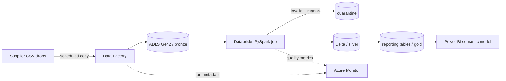

# Architecture and operating model

Raw files are immutable and date-partitioned in bronze. The silver job applies types,
business-key deduplication and referential checks. Gold contains only report-shaped
tables; Power BI does not query raw files. Rejected rows retain the input fields and a
reason so an operator can correct and replay them.

For a production deployment, use managed identities between services, Key Vault for
external credentials, private endpoints for storage, and lifecycle rules on bronze.
The batch date should be passed by Data Factory rather than inferred from wall-clock time.

